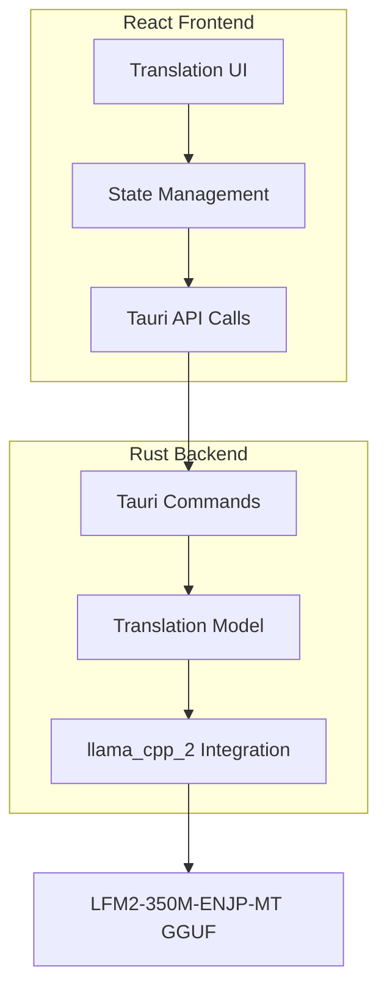
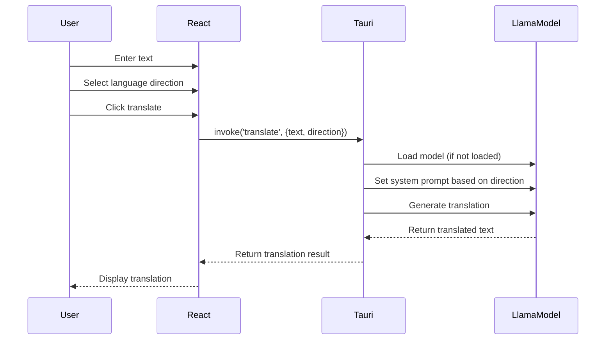

# Konnyaku - Local Translation Application Architecture Plan

## Project Overview
Konnyaku is a desktop translation application that runs entirely locally using the LiquidAI/LFM2-350M-ENJP-MT-GGUF model for English-Japanese bidirectional translation.

## System Architecture

### High-Level Architecture



## Component Breakdown

### Backend Components (Rust/Tauri)

1. **Translation Service Module** (`src-tauri/src/translation.rs`)
   - Initialize and manage the llama_cpp_2 model
   - Handle model loading and caching
   - Provide translation methods for both directions

2. **Tauri Commands** (`src-tauri/src/commands.rs`)
   - `translate` command: Main translation endpoint
   - `get_supported_languages` command: Return supported language pairs
   - `get_model_status` command: Check if model is loaded

3. **Model Configuration** (`src-tauri/src/config.rs`)
   - Model path configuration
   - System prompt templates for each translation direction
   - Model parameters (temperature, max tokens, etc.)

### Frontend Components (React)

1. **Main Translation Component** (`src/components/TranslationView.jsx`)
   - Two text areas (source and target)
   - Language selector/switcher
   - Translate button
   - Loading states

2. **Language Switcher Component** (`src/components/LanguageSwitcher.jsx`)
   - Toggle between EN→JP and JP→EN
   - Visual indicator of current direction

3. **Text Input Component** (`src/components/TextInput.jsx`)
   - Character count
   - Clear button
   - Auto-resize capability

4. **Translation Output Component** (`src/components/TranslationOutput.jsx`)
   - Read-only display
   - Copy to clipboard functionality

## Data Flow



## File Structure Organization

```
konnyaku/
├── src/                          # React frontend
│   ├── components/
│   │   ├── TranslationView.jsx
│   │   ├── LanguageSwitcher.jsx
│   │   ├── TextInput.jsx
│   │   └── TranslationOutput.jsx
│   ├── styles/
│   │   ├── App.css
│   │   └── components.css
│   ├── hooks/
│   │   └── useTranslation.js
│   ├── App.jsx
│   └── main.jsx
├── src-tauri/
│   ├── src/
│   │   ├── main.rs
│   │   ├── lib.rs
│   │   ├── translation.rs       # Translation service
│   │   ├── commands.rs          # Tauri commands
│   │   └── config.rs            # Model configuration
│   └── Cargo.toml               # Add llama_cpp_2 dependency
└── docs/
    ├── architecture-plan.md     # This file
    └── adr/                     # Architecture Decision Records
        └── 001-llama-integration.md
```

## Implementation Phases

### Phase 1: Backend Foundation
- Add llama_cpp_2 dependency to Cargo.toml
- Create translation service module
- Implement model loading and initialization
- Create basic translate command

### Phase 2: Frontend Structure
- Remove template code
- Create component structure
- Build basic UI layout
- Connect to backend commands

### Phase 3: Core Translation Feature
- Implement bidirectional translation logic
- Add proper error handling
- Implement loading states
- Test with actual model

### Phase 4: UI Polish
- Apply modern, clean design
- Add animations and transitions
- Implement keyboard shortcuts
- Add accessibility features

### Phase 5: Optimization
- Implement model caching
- Optimize translation performance
- Add translation history (optional)
- Performance monitoring

## Technical Considerations

### Model Management
- The GGUF model file should be downloaded and bundled with the application
- Model loading should happen on application startup or first translation request
- Keep model in memory for quick subsequent translations

### Error Handling
- Handle model loading failures gracefully
- Provide user-friendly error messages
- Implement retry mechanisms
- Add fallback behaviors

### Performance
- Use async/await for non-blocking operations
- Implement request debouncing for real-time translation
- Cache recent translations
- Monitor memory usage

### User Experience
- Provide immediate visual feedback
- Show loading indicators during translation
- Enable keyboard shortcuts (Cmd/Ctrl+Enter to translate)
- Auto-detect language (future enhancement)

## Next Steps
1. Review and approve this architectural plan
2. Set up the development environment
3. Begin implementation following the phases outlined above
4. Create detailed technical documentation as we build